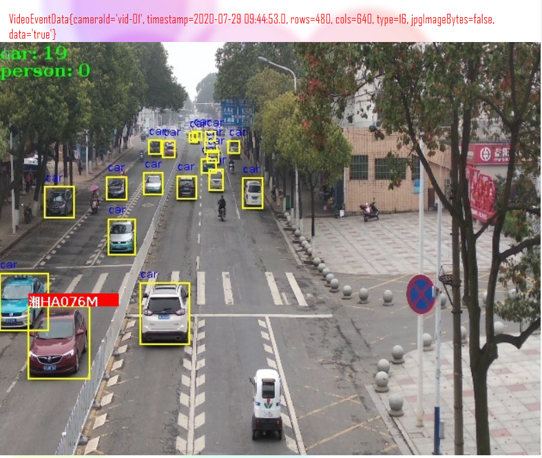
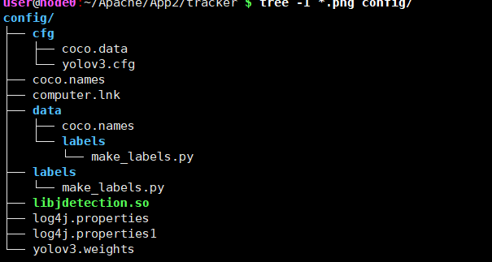
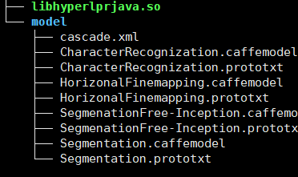
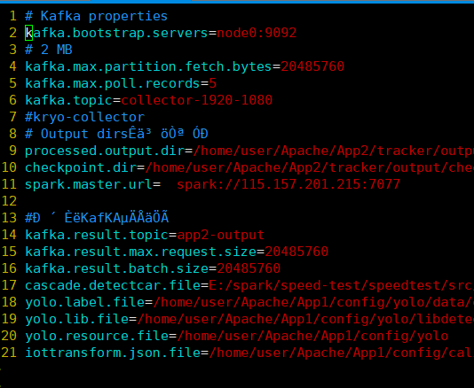
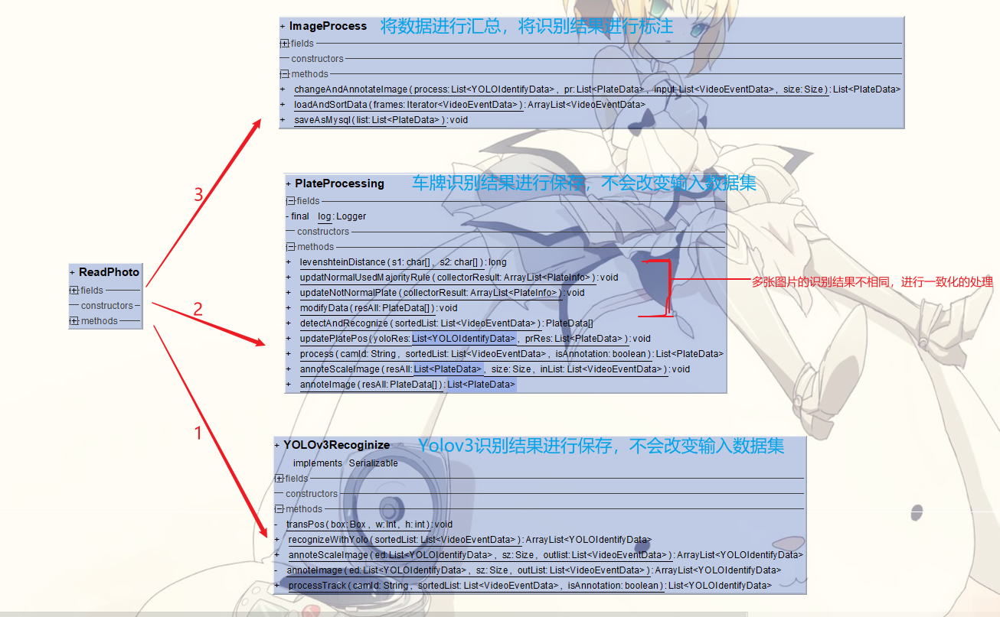

# 主要实现功能

从kafka读取帧数据，在spark平台上使用yolov3进行车辆识别，然后使用hyperLPR进行车牌识别，最终将识别结果进行标注，最终显示效果如下所示。最后存储的数据可以指定任意大小进行存储，数据存往kafka和mysql数据库中



#  简单使用

## shell 执行命令

```powershell
spark-submit --conf  spark.driver.extraJavaOptions="-Dlog4j.configuration=file:/home/user/Apache
/App2/tracker/config/log4j.properties"  --conf  spark.executor.extraJavaOptions="-Dlog4j.configuration=file:/home/user/Apache/App2/tracker/config/log4j.properties1" --driver-memory 60G --executor-memory 60G  spark2-1.0.jar  
```

代码的日志输出主题内部设置为app2，

## 要求linux执行的环境

mysql

 kafka 

spark 

yolov3

​		

hyperlpr

​	****

opencv

路径的设置需要自定义一个stream-processor.properties，具体的解析查看类AppConfig




# 主要实现类




